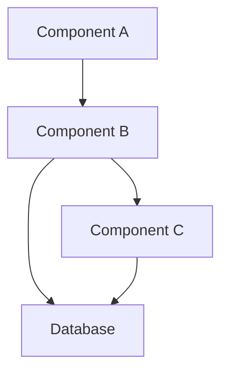

# Technical Specification Template

## Project Information
**Tech Spec Title:** [Clear, concise title describing the project]  
**SubTitle:** [Optional subtitle or project code name]  
**Description:** 💡 [Single sentence high-level description of the project]

| Role | Name | 
|------|------|
| Driver(s) | [Primary technical owner(s) responsible for implementation] |
| Approver(s) | [Stakeholder(s) who must approve the spec before work begins] |
| Contributors | [Team members contributing to implementation] |
| Informed | [Stakeholders who need to be kept informed of progress] |

**Product Spec:** [Link to product spec or any available higher-level documentation]

## 🔑 Purpose / Summary
[Provide a comprehensive yet concise summary (3-5 sentences) explaining what this project aims to achieve. This should give any reader a clear understanding of the project's purpose without requiring them to read the entire document.]

**Example:** This project will develop a reconciliation system to automate matching transactions from multiple seller sources with the NetSuite inventory system of record. The solution will reduce manual processing time by 80% and improve accuracy of financial reporting.

## 📰 Background
[Provide essential context about why this project is necessary. Include:
- Business problem or opportunity being addressed
- Current state and pain points
- Historical context if relevant
- How this project aligns with broader company objectives
- Reference any prior work or related systems

This section should be 3-5 paragraphs that ensure everyone has sufficient background knowledge.]

## 📑 Scope

### In-scope
[List all features, functionality, and work that will be delivered as part of this project. Be specific about what users will be able to do with the solution. Include all primary and secondary objectives.]

- **Primary objective:** [Describe the main deliverable in detail]
- **Secondary features:**
  - [Feature 1 with implementation details]
  - [Feature 2 with implementation details]
  - [Additional features as needed]

### Out of Scope
[Clearly list what will NOT be included in this project. This helps prevent scope creep and sets appropriate expectations with stakeholders. Be explicit about features that might be assumed to be included but are not.]

- [Out of scope item 1 - explain why if helpful]
- [Out of scope item 2]
- [Additional out of scope items]

### Project Phasing
[If the project will be delivered in multiple phases, describe each phase with corresponding milestones and tentative timelines. For each phase, outline:
- Goals and deliverables
- Dependencies on prior phases
- Key milestones with dates (if known)
- Success criteria for proceeding to the next phase]

**Example:** 
- **Phase 1 (MVP):** Basic reconciliation system supporting manual data import - Target: Q1 2025
- **Phase 2:** Automated daily imports and enhanced matching algorithms - Target: Q2 2025
- **Phase 3:** Advanced reporting and dashboard features - Target: Q3 2025

### Change Request Process
[Describe the process for evaluating and approving changes to the project scope after the spec is approved. Include:
- How stakeholders should submit change requests
- Who evaluates impact on timeline and resources
- Approval process for change requests
- How approved changes will be incorporated into the project plan]

## 🖌️ Design

### System Architecture
[Provide high-level diagrams and descriptions of the solution architecture. Include:
- System components and their relationships
- Data flows between components
- Integration points with existing systems
- Infrastructure requirements]

#### Architecture Diagram

[Explain the diagram and key architectural decisions. Include rationale for significant design choices.]

### Backend Design

#### Database Schema
[Describe database design details including:
- Entity relationship diagrams
- Table structures and relationships
- Key fields and data types
- Indexing strategy
- Data migration approach if applicable]

#### API Design
[Document API endpoints and interfaces:
- REST/GraphQL/RPC approach
- Endpoint definitions
- Request/response formats
- Authentication and authorization mechanisms
- Rate limiting and caching strategy]

#### Integration Points
[Detail how the system integrates with other systems:
- External APIs consumed
- Data exchange formats and protocols
- Error handling across system boundaries
- Synchronous vs. asynchronous communication]

#### Business Logic
[Describe core algorithms and business logic:
- Key workflows and processing steps
- Decision trees and conditional logic
- Data transformation and calculations
- State management]

### Frontend Design

#### User Interface Design
[Document UI/UX design approach:
- UI frameworks and libraries to be used
- Responsive design strategy
- Accessibility considerations
- Design system/component library usage]

#### Wireframes and Mockups
[Include key wireframes or link to design files:
- Page layouts and navigation flow
- Component designs
- State transitions
- Mobile vs. desktop considerations]

#### Frontend Architecture
[Detail the frontend architecture:
- Component structure and hierarchy
- State management approach
- Routing strategy
- Data fetching and caching
- Performance optimization techniques]

#### User Experience Considerations
[Document UX decisions:
- Loading states and feedback mechanisms
- Error handling and user notifications
- Form validation approach
- Responsive breakpoints and behavior]

### Technical Requirements

[List all technical constraints and requirements that the solution must meet:]

- **Performance requirements:** [Response times, throughput, concurrency, etc.]
- **Security requirements:** [Authentication, authorization, data protection, etc.]
- **Scalability requirements:** [Expected load, growth patterns, scaling strategy]
- **Reliability requirements:** [Uptime, failover, disaster recovery]
- **Maintainability requirements:** [Coding standards, documentation, monitoring]
- **Compliance requirements:** [Legal, regulatory, policy compliance needed]

**Implementation constraints:**
- [Infrastructure limitations]
- [Technology stack requirements]
- [Third-party dependencies]
- [Resource constraints]

### Technical Design Decisions
[Document key technical decisions with rationale. For each significant decision:
- Options considered
- Criteria for selection
- Pros and cons of each option
- Final decision and reasoning]

### Open Questions ⚠️
[List any unresolved technical questions that need answers before or during implementation. Assign owners and due dates for resolution where possible.]

- [Question 1] - Owner: [Name], Due: [Date]
- [Question 2] - Owner: [Name], Due: [Date]

## 👥 User Flow + Business Processes

### User Stories
[List detailed user stories in the format "As a [user type], I want to [action] so that [benefit]."]

- As a [user type], I want to [action] so that [benefit].
- As a [user type], I want to [action] so that [benefit].
- [Additional user stories]

### System Flow
[Describe the end-to-end process flow from a system perspective, including:
- Trigger events that initiate processes
- Sequential steps in each process
- Decision points and conditions
- Error handling and exception flows
- Completion criteria]

### Wireframes / Process Diagrams
[Include wireframes for UI components and visual process diagrams. For complex workflows, consider using sequence diagrams or swim lane diagrams to show interactions between different actors and systems.]

## 🎢 Risk Assessment

[Identify potential risks to project success and mitigation strategies. Consider conducting a pre-mortem exercise with the team to identify risks.]

| Risk | Likelihood | Impact | Risk Level | Mitigating Action | Contingent Action |
|------|------------|--------|------------|-------------------|-------------------|
| [Risk 1] | Low/Med/High | Low/Med/High | Low/Med/High | [Preventive measures to reduce likelihood] | [Actions to take if risk materializes] |
| [Risk 2] | Low/Med/High | Low/Med/High | Low/Med/High | [Preventive measures to reduce likelihood] | [Actions to take if risk materializes] |

[Consider risks related to:
- Technical feasibility and complexity
- Resource availability and capabilities
- Integration challenges
- Performance and scalability
- Security vulnerabilities
- Data integrity and migration
- Timeline constraints
- Dependency management
- Business process changes]

## 🧪 Testing and Quality Assurance

### Test Strategy
[Describe the overall approach to testing, including:
- Types of testing required (unit, integration, system, performance, security)
- Testing environments needed
- Responsibilities for test execution
- Automation strategy]

### Test Cases

| ID | Test Scenario | Given | When | Then | Priority |
|----|---------------|-------|------|------|----------|
| TC-01 | [Scenario description] | [Initial state] | [Action performed] | [Expected outcome] | High/Med/Low |
| TC-02 | [Scenario description] | [Initial state] | [Action performed] | [Expected outcome] | High/Med/Low |

### Validation Approach
[Describe how you will validate the solution meets requirements:
- Acceptance criteria for each feature
- Stakeholder review process
- User acceptance testing plan
- Performance validation methods]

### Monitoring and Alerting
[Specify how the solution will be monitored in production:
- Key metrics to track
- Alert thresholds and notification channels
- Logging strategy
- Performance dashboard requirements
- Health checks and diagnostic tools]

## ➡️ Rollout / Deployment Plan

### Deployment Strategy
[Detail how the solution will be deployed to production:
- Deployment method (e.g., blue/green, canary, phased)
- Required downtime (if any)
- Resource requirements for deployment
- Deployment sequence and dependencies
- Post-deployment verification steps]

### Migration Plan
[If data migration is required:
- Source and target data structures
- Transformation rules
- Validation criteria
- Estimated data volumes
- Migration timeline and resource requirements
- Rollback plan in case of migration failure]

### Feature Flag Strategy
[If using feature flags:
- Features to be flagged
- Flag configuration by environment
- Criteria for flag activation
- Testing strategy for flagged features
- Monitoring approach during flag transitions]

### Rollback Plan
[Define specific conditions and procedures for rollback:
- Rollback trigger criteria
- Step-by-step rollback procedure
- Required approvals for rollback decision
- Data recovery approach
- Communication plan for rollback scenario]

## 🏆 Measuring Success

[Define specific metrics to measure project success:]

| Metric | Current Value | Target Value | Measurement Method |
|--------|--------------|-------------|-------------------|
| [Metric 1] | [Baseline] | [Target] | [How and when it will be measured] |
| [Metric 2] | [Baseline] | [Target] | [How and when it will be measured] |

[Include both technical metrics (performance, errors, etc.) and business metrics (efficiency gains, cost savings, etc.)]

## 🎧 Detailed Requirements

### Functional Requirements
[List detailed functional requirements that must be satisfied:]

1. [Requirement 1]
2. [Requirement 2]
3. [Additional requirements]

### Non-Functional Requirements
[List detailed non-functional requirements related to:]

1. **Performance:** [Response time, throughput, resource usage]
2. **Security:** [Authentication, authorization, data protection]
3. **Usability:** [User experience, accessibility]
4. **Reliability:** [Availability, failure handling, recovery]
5. **Maintainability:** [Code structure, documentation]
6. **Scalability:** [Growth accommodation]
7. **Compatibility:** [Browser/device support, integrations]

### API Requirements
[For projects involving APIs, specify:
- Endpoints and methods
- Request/response formats
- Authentication mechanism
- Rate limiting
- Error handling
- Versioning strategy]

## 🧑‍💻 Development Resources

### Environment Setup
[Provide instructions for setting up development environment:
- Required software and tools
- Configuration settings
- Access requirements
- Local testing guidance]

### Documentation Resources
[List relevant documentation and references:
- Architectural guidelines
- Coding standards
- API documentation
- Related system documentation
- Useful libraries and frameworks]

### Collaboration & Communication
[Specify how the team will collaborate:
- Communication channels
- Code review process
- Meeting cadence
- Status reporting method]

## Approvals

| Role | Name | Approval Date |
|------|------|---------------|
| Technical Lead | | |
| Product Manager | | |
| Engineering Manager | | |
| Security Review | | |
| Additional Stakeholders | | |

## Sprint Planning & Implementation

### Fibonacci Estimation Explanation
[The Fibonacci estimation scale uses the Fibonacci sequence (1, 2, 3, 5, 8, 13, 21, etc.) to size work items. This scale reflects the inherent uncertainty in estimating larger tasks:

- **1 point**: Trivial task, well understood with virtually no risk
- **2 points**: Simple task, clear solution, minimal risk
- **3 points**: Straightforward task with some complexity
- **5 points**: Moderate complexity, some unknowns
- **8 points**: Complex task with significant unknowns
- **13 points**: Very complex task with high uncertainty
- **21+ points**: Task too large, should be broken down further

Teams use this scale for relative sizing rather than absolute time estimates, as the non-linear progression helps teams acknowledge that larger tasks have disproportionately more uncertainty.]

### Sample Sprint Plan

**Sprint Goal:** [Deliver core reconciliation functionality with basic UI]  
**Sprint Duration:** [2 weeks]  
**Sprint Capacity:** [100 points]

#### Sprint Backlog

| ID | User Story | Description | Acceptance Criteria | Points | Assignee |
|----|------------|-------------|---------------------|--------|----------|
| PROJ-001 | Database Schema Setup | Create database tables and relationships according to schema design | • All tables created with proper relationships • Indexing implemented as specified • Migration script tested in staging | 5 | [Developer] |
| PROJ-002 | API Authentication | Implement OAuth authentication for API endpoints | • Token-based auth working • Refresh token flow implemented • Auth failure cases handled properly | 8 | [Developer] |
| PROJ-003 | Transaction Import Module | Create service to import transactions from external sources | • Support CSV and JSON formats • Validate incoming data • Log validation errors • Successfully store valid transactions | 13 | [Developer] |
| PROJ-004 | Matching Algorithm | Implement core algorithm to match transactions | • Match based on defined criteria • Handle partial matches • Log unmatched transactions • 95% accuracy on test dataset | 13 | [Developer] |
| PROJ-005 | Transaction List UI | Create frontend component to display transaction list | • Responsive grid layout • Sorting and filtering • Pagination • Show transaction status | 8 | [Developer] |
| PROJ-006 | Transaction Detail View | Create UI for viewing transaction details | • Display all transaction fields • Show matching history • Allow manual matching • Support notes/comments | 5 | [Developer] |
| PROJ-007 | Basic Reporting | Implement summary dashboard with key metrics | • Show match rate • Display unmatched transactions • Filter by date range • Export to CSV | 8 | [Developer] |
| PROJ-008 | E2E Testing | Create end-to-end tests for core user flows | • Test transaction import • Test matching process • Test manual matching • Test reporting | 5 | [QA] |

#### Development Tasks by Story

**PROJ-001: Database Schema Setup**
- Create database migration script
- Implement entity models
- Set up test data population
- Document schema

**PROJ-003: Transaction Import Module**
- Create import service classes
- Implement data validation logic
- Build error handling and logging
- Create unit tests

[Include similar task breakdowns for other stories as needed]

## Appendices

### A. Technical Investigation Findings
[Include results of any proof-of-concept work, technical spikes, or research conducted]

### B. Glossary
[Define key terms and acronyms used in the document]

### C. Referenced Documents
[List all documents referenced with links/locations]

### D. Meeting Notes
[Include or link to key meeting notes related to the spec development]
